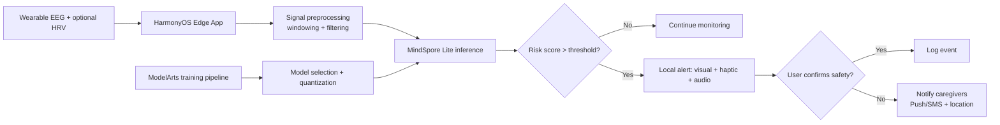

# auraS

MindSpore-powered, privacy-first seizure early warning system for the Huawei ICT Competition 2025-2026 Innovation Competition.

## Project Context

- Competition: Huawei ICT Competition 2025-2026, Innovation Track
- Topic: Topic 1 - Developing AI innovation applications powered by MindSpore
- Team: Pierogi, Poznan University of Technology
- Entry name: auraS
- Domain: Healthcare, medicine, public welfare

## Vision

auraS is a Cloud-Train, Edge-Infer platform that predicts pre-seizure states from EEG (and later multimodal wearable signals) in near real-time.

The system focuses on:

- Safety first: maximize Recall/Sensitivity to reduce missed events
- Practicality: low latency and low energy inference on mobile devices
- Trust: privacy-preserving on-device inference with minimal cloud exposure
- Care continuity: caregiver alerting with geolocation when risk is detected

## Problem Statement

Epilepsy events are difficult to predict, and unpredictability causes injury risk, anxiety, and reduced independence. Hospital EEG monitoring is limited in duration, while many consumer wearables lack clinically informed prediction quality.

auraS addresses this by combining robust EEG modeling in MindSpore with edge deployment in MindSpore Lite and HarmonyOS-centric safety workflows.

## Architecture Overview



### Layers

- Data layer: public EEG datasets and future wearable streams
- Modeling layer: baseline and SOTA candidate time-series architectures
- Edge inference layer: quantized MindSpore Lite model on smartphone
- Service layer: location-aware caregiver notifications
- Cloud training layer: ModelArts retraining and model governance

## Repository Structure

```text
.
├── app/
│   └── harmonyos/
├── configs/
│   ├── data/
│   ├── model/
│   └── train/
├── data/
│   ├── external/
│   ├── interim/
│   ├── processed/
│   └── raw/
├── docs/
├── experiments/
│   ├── notebooks/
│   └── runs/
├── infra/
│   └── modelarts/
├── scripts/
├── src/
│   └── auras/
│       ├── data/
│       ├── deployment/
│       ├── inference/
│       ├── models/
│       └── training/
└── tests/
```

## Model Strategy

Planned candidate families (from baseline to advanced):

- LSTM / BiLSTM baseline
- ResNet1D / MobileNetV3-1D efficiency baselines
- GhostNet-1D as Huawei-optimized candidate
- MobileViT-1D / Autoformer for long-range dependencies

Primary optimization target is high Recall under constrained false alarm rate and mobile inference budget.

## Experiment Design

Each experiment run is tracked with:

- Dataset split and channel strategy
- Model config (architecture + params)
- Training config (loss weighting, optimizer, schedule)
- Evaluation metrics: Recall, Precision, F1, FAR, AUC, latency, energy proxy
- Artifacts: checkpoints, logs, confusion matrix, calibration curve

See `docs/experiment-matrix.md` for canonical study design.

## Execution Plan (Step-by-Step)

1. Data readiness
- Prepare CHB-MIT, TUH, Siena metadata adapters
- Standardize schema and channel mapping
- Implement denoising and windowing pipeline

2. Baseline modeling
- Train weighted LSTM/BiLSTM baseline
- Establish calibration and thresholding procedure

3. Efficient model sweep
- Train MobileNetV3-1D and GhostNet-1D variants
- Compare quality-latency-energy trade-offs

4. Advanced architecture sweep
- Evaluate MobileViT-1D and Autoformer
- Run ablations for sequence length and channel subsets

5. Edge deployment
- Convert best models to MindSpore Lite (`.ms`) and quantize
- Validate edge latency and memory on target device

6. Safety workflow integration
- Implement risk-state UX and caregiver escalation path
- Test end-to-end alert reliability and failure handling

7. Demo hardening
- Freeze reproducible configs and final benchmark table
- Package architecture narrative, slides, and live demo script

See `docs/execution-plan.md` for milestones and deliverables.

## Quickstart

### 1. Environment

```bash
python3 -m venv .venv
source .venv/bin/activate
pip install -r requirements.txt
```

### 2. Configure a baseline run

```bash
cp .env.example .env
bash scripts/setup_env.sh
bash scripts/run_experiment.sh configs/model/lstm.yaml configs/train/default.yaml
```

### 3. Evaluate and export

```bash
bash scripts/evaluate_model.sh experiments/runs/latest
bash scripts/export_lite.sh experiments/runs/latest/checkpoints/best.ckpt
```

## KPIs and Success Criteria

- Clinical utility proxy: high Recall with controlled FAR
- Runtime utility: low edge latency for real-time monitoring
- Device utility: low compute and energy cost for continuous operation
- Human utility: faster safety actions and lower caregiver uncertainty

## Safety, Privacy, and Ethics

- Inference on device by default
- Minimize raw signal upload and anonymize all training artifacts
- Maintain audit trail of model versions and thresholds
- Position as a decision support system, not autonomous diagnosis

## Team

- Piotr Zwierzykowski (Instructor)
- Alicja Augustyniak
- Patryk Maciejewski
- Filip Domanski

## Status

Repository scaffold prepared for implementation and experimentation.

Next immediate work: implement dataset adapters, baseline training loop, and edge export validation.
